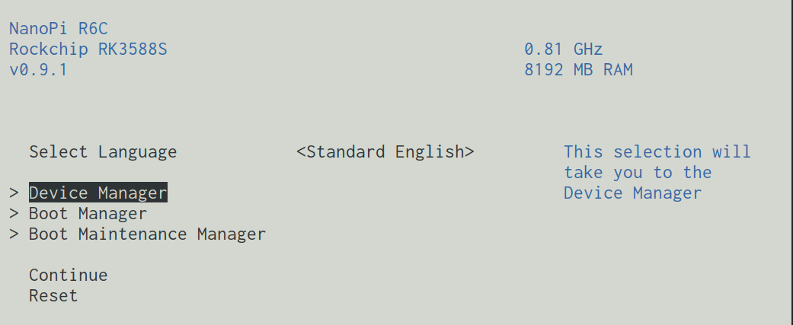

# Description

Describes installation process on Rock 5B `israfel` host.

# Bootloader

The best available bootloader is [EDK2 UEFI firmware for Rockchip RK3588 platforms](https://github.com/edk2-porting/edk2-rk3588). The [`0.9.1`](https://github.com/edk2-porting/edk2-rk3588/releases/tag/v0.9.1) release is confirmed working.

In order to flash this bootloader we'll need to download the bootloader image:

* [`nanopi-r6c_UEFI_Release_v0.9.1.img`](https://github.com/edk2-porting/edk2-rk3588/releases/download/v0.9.1/nanopi-r6c_UEFI_Release_v0.9.1.img)

And write it to the eMMC device:
```
NanoPi-R6C% sudo dd if=nanopi-r6c_UEFI_Release_v0.9.1.img of=/dev/mmcblk2 bs=1M
6+1 records in   
6+1 records out
7012864 bytes (7.0 MB, 6.7 MiB) copied, 0.0319496 s, 219 MB/s
```
Now the device has a graphical bootloader available when pressing `Escape` at boot time:



# Partitioning

To partition the NVMe the following layout is used:
```sh
format() {
  parted -s --align optimal "$1" -- mklabel gpt;
  parted -s --align optimal "$1" -- mkpart 'EFI'  2MB   6GiB  set 1 esp on;
  parted -s --align optimal "$1" -- mkpart 'SWAP' 6GiB  16GiB;
  parted -s --align optimal "$1" -- mkpart 'ROOT' 16GiB '100%';
  parted -s --align optimal "$1" -- print;
  mkswap /dev/nvme0n1p2;
  mkfs.vfat /dev/nvme0n1p1;
  mkfs.ext4 /dev/nvme0n1p3;
}
```

# Installation

Mount volumes:
```sh
swapon /dev/nvme0n1p2
mount /dev/nvme0n1p2 /mnt
mkdir /mnt/boot
mount /dev/nvme0n1p1 /mnt/boot
```
After configuring NixOS run installation process:
```
nix-channel --update
nixos-install
```
Unmount and reboot:
```
umount /mnt/boot
umount /mnt
reboot
```
