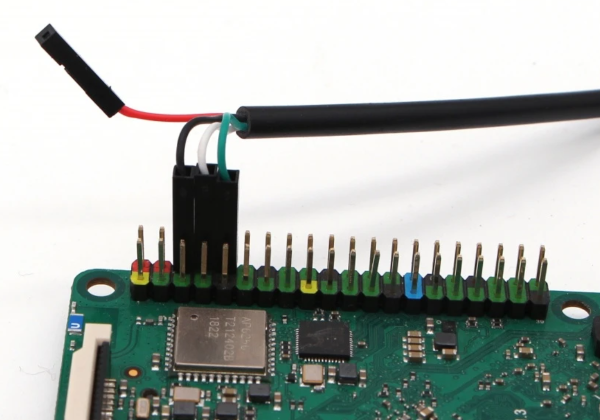

# UART Debug Console

Device provides a Debug UART via [40-pin GPIO connector](https://docs.radxa.com/en/rock5/rock5c/hardware-design/hardware-interface?target=rock-5c#40-pin-gpio-header).
To connect to you will need a USB to UART converterreceiver that supports the speed of 1500000bps.

# Connection

| ROCK 5c    | USB to TTL |
|------------|------------|
| GND(pin 6) | Black wire |
| TX(pin 8)  | White wire |
| RX(pin 10) | Green wire |



See this for full [GPIO Diagram](./images/gpio_diagram.png).

Source: <https://docs.radxa.com/en/rock5/rock5c/radxa-os/serial>

GPIO Table: <https://docs.radxa.com/en/rock4/rock4d/hardware-use/pin-gpio#gpio-features>

# Settings

```
baudrate: 1500000
data bit: 8
stop bit: 1
parity  : none
flow control: none
```

# Usage

You can use `minicom` or `picocom` to connect:
```sh
sudo minicom -b 1500000 -D /dev/ttyUSB0
sudo picocom -b 1500000 /dev/ttyUSB0
```
