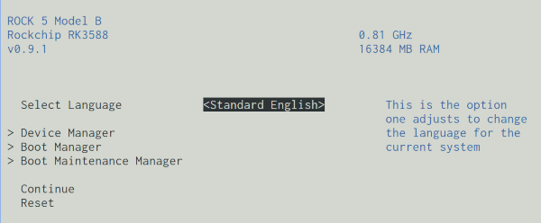

# Description

Describes installation process on Rock 5B `israfel` host.

# Bootloader

The best available bootloader is [EDK2 UEFI firmware for Rockchip RK3588 platforms](https://github.com/edk2-porting/edk2-rk3588). The [`0.9.1`](https://github.com/edk2-porting/edk2-rk3588/releases/tag/v0.9.1) release is confirmed working.

In order to flash this bootloader we'll need to download two files:

* [`rk3588_spl_loader_v1.15.113.bin`](https://dl.radxa.com/rock5/sw/images/loader/rock-5b/release/rk3588_spl_loader_v1.15.113.bin) - SPI bootloader image.
* [`rock-5b_UEFI_Release_v0.9.1.img`](https://github.com/edk2-porting/edk2-rk3588/releases/download/v0.9.1/rock-5b_UEFI_Release_v0.9.1.img) - UEFI bootloader image.

The decide needs to be put into [Markrom mode](https://wiki.radxa.com/Rock5/install/spi#3.29_Boot_the_board_to_Maskrom_mode) which requires connecting to the device via power USB-C and pressing the button in the corner below GPIO conector.

Then use the [`rkdeveloptool`](https://wiki.radxa.com/Rock5/install/rockchip-flash-tools) tool in version `1.32` or higher as described in [SPI flashing documentation](https://wiki.radxa.com/Rock5/install/spi):
```
 > nix-shell -p rkdeveloptool

[nix-shell:~/rk3588]$ rkdeveloptool --version
rkdeveloptool ver 1.32

[nix-shell:~/rk3588]$ sudo rkdeveloptool db rk3588_spl_loader_v1.08.111.bin
Downloading bootloader succeeded.

[nix-shell:~/rk3588]$ sudo rkdeveloptool wl 0 rock-5b_UEFI_Release_v0.9.1.img
Write LBA from file (100%)

[nix-shell:~/rk3588]$ sudo rkdeveloptool rb
```
Now the device has a graphical bootloader available when pressing `Escape` at boot time:



# Install Image

I used an Armbian 23.8 Bookworm image: <https://www.armbian.com/rock-5b/>

:warning: The stock [NixOS `aarch64` SD image](https://hydra.nixos.org/job/nixos/release-24.11/nixos.sd_image.aarch64-linux) does not work currently.

Alternatively a [NixOS `aarch64` ISO image](https://hydra.nixos.org/job/nixos/release-24.11/nixos.iso_minimal.aarch64-linux) can be used on a USB pendrive.

Install Nix package manager using [the usual methods](https://nixos.wiki/wiki/Nix_Installation_Guide) and then install `nixos-install-tools`:
```sh
apt install --yes xz-utils git tmux linux-headers-vendor-rk35xx linux-headers-edge-rockchip-rk3588
apt install --yes zfs-dkms zfsutils
sh <(curl -L https://nixos.org/nix/install) --daemon --yes
source /nix/var/nix/profiles/default/etc/profile.d/nix-daemon.sh
nix-env -iA nixos-install-tools
```

# Installation

Install [Disko partitioning tool](https://github.com/nix-community/disko)
```sh
nix --extra-experimental-features 'nix-command flakes' profile install 'github:nix-community/disko/latest'
```
Partition the filesystem:
```sh
disko --mode destroy,format,mount --flake 'github:jakubgs/nixos-config#iruel' --yes-wipe-all-disks
```
Perform the installation:
```sh
nixos-install --flake 'github:jakubgs/nixos-config#iruel'
```

See [MANUAL.md](./MANUAL.md) for step-by-step instructions.
