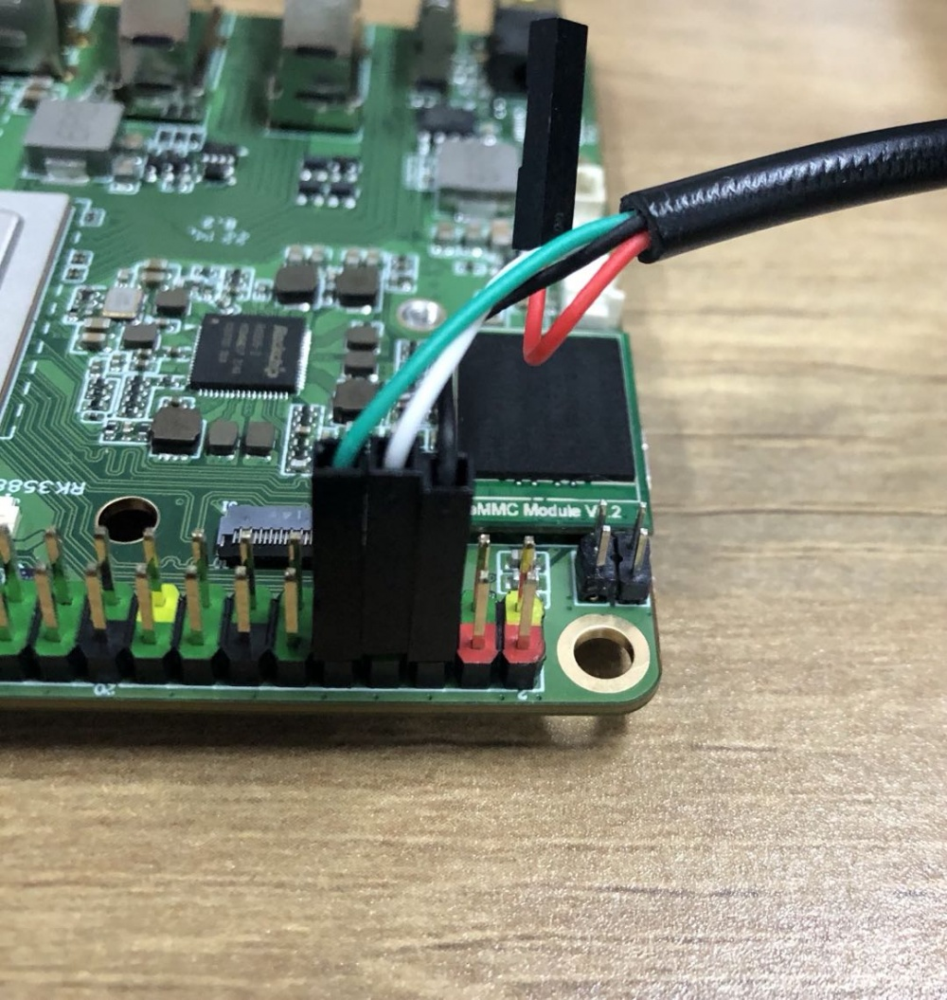

# UART Debug Console

Device provides a Debug UART via [40-pin GPIO connector](https://wiki.radxa.com/Rock5/hardware/5b/gpio).
To connect to you will need a USB to UART converterreceiver that supports the speed of 1500000bps.

# Connection

| ROCK 5     | USB to TTL |
|------------|------------|
| RX(pin 10) | Green wire |
| TX(pin 8)  | White wire |
| GND(pin 6) | Black wire |



See this for full [GPIO Diagram](./images/gpio_diagram.jpg).

Source: <https://wiki.radxa.com/Rock5/dev/serial-console>

# Settings

```
baudrate: 1500000
data bit: 8
stop bit: 1
parity  : none
flow control: none
```

# Usage

You can use `minicom` or `picocom` to connect:
```sh
sudo minicom -b 1500000 -D /dev/ttyUSB0
sudo picocom -b 1500000 /dev/ttyUSB0
```
